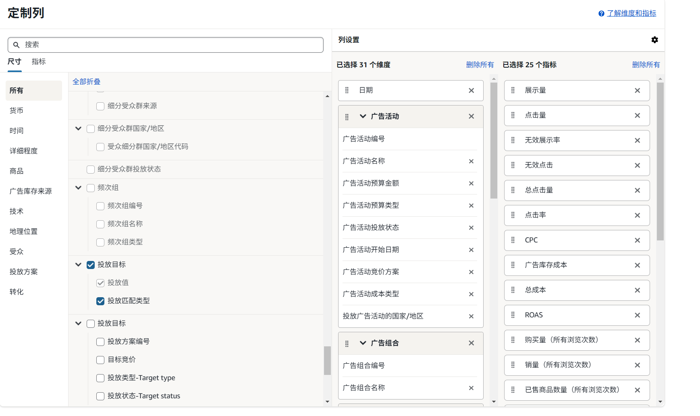

# Amazon Ops Automation

## Configuration Tables

> [!IMPORTANT]
> 真实运营前必须先替换 demo 配置。配置表会影响 SKU/ASIN 合并、利润判断、target ACOS、库存风险、SKU 别名归一和前台检查地区。

| 配置文件 | 用途 | 最小必填 |
| --- | --- | --- |
| [`config/product_cost_config.xlsx`](config/templates/product_cost_config.example.xlsx) | 产品、成本、价格、利润、target ACOS、库存口径 | `marketplace`、`sku`、`asin`、`product_name`、`currency` |
| [`config/sku_asin_map.xlsx`](config/templates/sku_asin_map.example.xlsx) | SKU/ASIN/站点基础映射 | `marketplace`、`sku`、`asin`、`product_name`、`currency` |
| [`config/sku_alias_map.xlsx`](config/templates/sku_alias_map.example.xlsx) | 把广告或 ERP 里的别名 SKU 归一到正式 SKU | `marketplace`、`source_sku`、`canonical_sku`、`asin` |
| [`config/product_line_keywords.json`](config/product_line_keywords.json) | 产品线关键词分层，影响搜索词相关性和否词判断 | `product_lines`、`keyword_levels` |
| [`config/frontend_locations.json`](config/templates/frontend_locations.example.json) | UK/US/DE 前台检查使用的邮编和地区口径 | 站点键 + `postcode` |

<details>
<summary>product_cost_config.xlsx 字段说明</summary>

Sheet 名必须是 `product_cost_config`。模板字段：

```text
marketplace	currency	sku	asin	product_name	source_row	selling_price	exchange_rate	purchase_cost_rmb	purchase_cost_local	first_leg_cost_rmb	first_leg_cost_local	packaging_cost_local_input	referral_fee	digital_tax	vat	storage_fee_estimate	return_fee_estimate	fba_fee	ad_fee_10pct	amazon_fees_excl_ads	landed_cost_excl_amazon	total_cost_before_ads	profit_before_ads	break_even_acos	suggested_target_acos	profit_after_10pct_ads	profit_margin_after_10pct_ads	roi_after_10pct_ads	chargeable_weight_g	volumetric_weight_g	actual_weight_g	length_cm	width_cm	height_cm	current_inventory	sea_inventory	inventory_note	mapping_status	mapping_note	cost_status
```

关键判断：

1. `marketplace + sku + asin` 是核心合并键，不能随意换口径。
2. `selling_price`、`purchase_cost_local`、`first_leg_cost_local`、`fba_fee`、`referral_fee` 会影响利润和 break-even ACOS。
3. `suggested_target_acos` 会影响广告放量、降竞价和成本风险判断。填 0 或缺失会导致系统收紧建议。
4. `current_inventory`、`sea_inventory`、`inventory_note` 会影响补货和库存风险提示。

</details>

<details>
<summary>sku_asin_map.xlsx 字段说明</summary>

模板字段：

```text
marketplace	sku	asin	product_name	currency
```

判断依据：

1. 系统按 `marketplace + sku + asin` 合并广告、ERP、成本和历史数据。
2. `product_name` 用于报告展示和产品线识别。
3. `currency` 用于金额展示和站点口径。

</details>

<details>
<summary>sku_alias_map.xlsx 字段说明</summary>

模板字段：

```text
marketplace	source_sku	canonical_sku	asin	reason
```

使用规则：

1. `source_sku` 是广告或 ERP 原始导出里出现的 SKU。
2. `canonical_sku` 是正式配置表里的标准 SKU。
3. 同一 `marketplace + source_sku + asin` 出现多行时，系统保留最后一条。
4. `reason` 建议写清楚来源，例如 FBA SKU、ERP SKU、历史别名。

</details>

<details>
<summary>product_line_keywords.json 和关键词 CSV 模板</summary>

`product_line_keywords.json` 使用五层关键词：

| 层级 | 用途 |
| --- | --- |
| `核心词` | 高相关购买意图词，优先控竞价和查 Listing，不能轻易否定 |
| `可测词` | 相关长尾或相邻词，适合小预算测试 |
| `泛词` | 大类词，未验证前低竞价保守跑 |
| `低质词` | 弱相关或语义模糊词，观察或低价 |
| `禁词` | 明显不相关词，达到点击或花费阈值后可否定精准 |

CSV 模板 [`config/templates/product_keyword_rules.example.csv`](config/templates/product_keyword_rules.example.csv) 字段：

```text
product_line	level	keyword	notes
```

</details>

<details>
<summary>frontend_locations.json 字段说明</summary>

模板结构：

```json
{
  "UK": {"postcode": "SW1A 1AA", "location_label": "London demo location"},
  "US": {"postcode": "10001", "location_label": "New York demo location"},
  "DE": {"postcode": "10115", "location_label": "Berlin demo location"}
}
```

风险判断：

1. 邮编会影响 Amazon 前台价格、配送、Buy Box 和竞品展示。
2. 前台检查是辅助证据，不能替代广告、ERP、成本和产品级窗口指标。
3. 真实运营时应换成对应站点的目标配送地区。

</details>

## Advertising Export Columns

> [!IMPORTANT]
> 后台自定义广告报表列时，先保证 10 个必选字段。缺少必选字段会影响导入；缺少搜索词、ASIN 定向和点击归因字段，会降低广告动作判断质量。

| 口径 | 字段 |
| --- | --- |
| 必选字段 | `日期`、`广告活动名称`、`推广的商品 SKU`、`推广的商品编号`、`推广的商品站点`、`展示量`、`点击量`、`总成本`、`购买量（所有浏览次数）`、`销售额` |
| 建议范围 | 30 个尺寸列 + 25 个指标列 |
| 判断依据 | `src/parse_ads_report.py` 的 `REQUIRED_ADS_COLUMNS`、`ADS_FIELD_SPECS`、`ATTRIBUTION_FIELDS` |

**最小可用表头**

```text
日期	广告活动名称	推广的商品 SKU	推广的商品编号	推广的商品站点	展示量	点击量	总成本	购买量（所有浏览次数）	销售额
```

<details>
<summary>完整推荐表头，可复制到 Excel 第一行</summary>

```text
日期	广告产品	预算货币	广告活动编号	广告活动名称	广告活动投放状态	广告活动预算金额	广告活动预算类型	广告活动竞价方案	广告活动成本类型	投放广告活动的国家/地区	广告组合编号	广告组合名称	推广的商品编号	推广的商品 SKU	推广的商品站点	广告组编号	广告组名称	广告组投放状态	广告组计费模式	广告 ID	广告名称	广告投放状态	搜索词	匹配的目标	投放值	投放匹配类型	广告位名称	广告位分类	展示量	点击量	总点击量	点击率	CPC	总成本	ROAS	购买量（所有浏览次数）	销量（所有浏览次数）	已售商品数量（所有浏览次数）	购买率（所有浏览次数）	销售额	归因于点击的购买量	归因于点击的销售额	归因于点击的 ROAS	归因于点击的单次购买成本	归因于点击的购买量（推广的商品）	归因于点击的销售额（推广的商品）	由浏览产生的销售额（推广的商品）	归因于点击的购买量（光环）	归因于点击的销售额（品牌光环）	归因于点击的已售商品数量（品牌光环）	无效展示率	无效点击
```

</details>

<details>
<summary>后台勾选清单</summary>

| 类型 | 建议勾选 |
| --- | --- |
| 尺寸列 | 日期、广告产品、预算货币、广告活动编号、广告活动名称、广告活动预算金额、广告活动预算类型、广告活动投放状态、广告活动开始日期、广告活动竞价方案、广告活动成本类型、投放广告活动的国家/地区、广告组合编号、广告组合名称、推广的商品编号、推广的商品 SKU、推广的商品站点、广告组编号、广告组名称、广告组投放状态、广告组计费模式、广告 ID、广告名称、广告投放状态、搜索词、匹配的目标、投放值、投放匹配类型、广告位名称、广告位分类 |
| 指标列 | 展示量、点击量、无效展示率、无效点击、总点击量、点击率、CPC、广告库存成本、总成本、ROAS、购买量（所有浏览次数）、销量（所有浏览次数）、已售商品数量（所有浏览次数）、购买率（所有浏览次数）、销售额、归因于点击的购买量、归因于点击的销售额、归因于点击的 ROAS、归因于点击的单次购买成本、归因于点击的购买量（推广的商品）、归因于点击的销售额（推广的商品）、由浏览产生的销售额（推广的商品）、归因于点击的购买量（光环）、归因于点击的销售额（品牌光环）、归因于点击的已售商品数量（品牌光环） |

</details>

<details>
<summary>广告后台定制列截图</summary>



</details>

<details>
<summary>风险说明</summary>

1. `广告库存成本` 和 `总成本` 都建议保留。系统当前把 `总成本` 作为核心成本字段，同时也把 `广告库存成本` 识别为成本来源。
2. `搜索词`、`匹配的目标`、`投放值`、`投放匹配类型` 缺失时，产品级报表还能跑，但搜索词和 ASIN 定向动作会明显变弱。
3. 点击归因字段缺失时，系统会按 0 兜底。风险是推广 SKU 订单和光环订单无法拆分，容易把光环成交误判成投放对象有效。
4. `由浏览产生的销售额（推广的商品）` 当前核心解析不依赖，但历史字段审计里出现过该列，保留它可以降低后续归因口径变化风险。
5. 当前代码只检查 `bid` 或 `keyword_bid` 这类字段名。中文后台里的 `目标竞价` 即使导出，当前版本也未必会被识别为具体竞价字段。影响是报告可以给降竞价比例，但不能稳定给具体新 bid。

</details>

Offline Amazon marketplace intelligence console for turning ads, sales, cost, SKU, and ASIN exports into operator-ready reports, action queues, and review workflows.

This public repository is a clean demo snapshot. It shows the architecture, report workflow, and local operating console without exposing private store data, historical outputs, browser profiles, cookies, sessions, or real cost/SKU configuration files.

## Repository Scope

This repo is intended for three uses:

- Review the reporting and decision-workflow architecture.
- Run a local demo with generated fake data.
- Adapt the pipeline to your own Amazon marketplace exports.

It is not a hosted SaaS product, a managed Amazon API integration, or a plug-and-play decision engine. Real operating decisions require your own clean exports, cost tables, SKU/ASIN mapping, and marketplace-specific validation.

## Platform Status

This public demo is designed for local macOS and Windows smoke tests.

- Core report generation is plain Python and does not require a browser.
- Python 3.13 is supported through the `legacy-cgi` compatibility dependency used by the local upload service.
- Windows launchers are included for daily report generation, local report buttons, and frontend retry sessions.
- Live browser frontend checks remain optional. Amazon can still block or challenge browser reads, so browser evidence is never required for demo report generation.

## What It Does

- Parses Amazon ads CSV files and ERP sales workbooks.
- Joins data by `marketplace + sku + asin`.
- Computes rolling product and search-term metrics.
- Produces HTML, JSON, Markdown, and Excel reports.
- Builds an operations workbench for ad actions, low-budget keyword tests, frontend evidence, and review queues.
- Keeps optional Amazon frontend checks as best-effort enrichment, not a hard dependency.
- Includes a local demo data generator so the project can run after clone.

## Quick Start

### macOS or Linux shell

```bash
python3 -m venv .venv
.venv/bin/python -m pip install --upgrade pip
.venv/bin/python -m pip install -r requirements.txt
.venv/bin/python scripts/setup_demo_data.py
.venv/bin/python main.py --marketplace ALL --safe-run
```

### Windows PowerShell

```powershell
py -3 -m venv .venv
.\.venv\Scripts\python.exe -m pip install --upgrade pip
.\.venv\Scripts\python.exe -m pip install -r requirements.txt
.\.venv\Scripts\python.exe scripts\setup_demo_data.py
.\.venv\Scripts\python.exe main.py --marketplace ALL --safe-run
```

Reports are written under:

```text
data/output/safe_run/<timestamp>/
```

Open:

```text
latest_recommendations.html
dashboard.html
summary.html
```

## Local Launchers

After installing dependencies and creating demo data, the root launchers can be used for a local operator-style session.

| Platform | Daily report with local buttons | Start button service only | Retry frontend checks |
| --- | --- | --- | --- |
| macOS | `run_today_report.command` | `start_report_action_server.command` | `retry_frontend_checks.command` |
| Windows | `run_today_report.bat` | `start_report_action_server.bat` | `retry_frontend_checks.bat` |

The default daily workflow uses no-browser frontend checks with cache fallback. To try live Chrome CDP checks, set `AMAZON_OPS_ENABLE_BROWSER_FRONTEND=1`. On Windows, set `AMAZON_OPS_CHROME_PATH` if Chrome is not installed at:

```text
C:\Program Files\Google\Chrome\Application\chrome.exe
```

## Demo Data

`scripts/setup_demo_data.py` creates fake runtime inputs:

```text
config/product_cost_config.xlsx
config/sku_alias_map.xlsx
data/raw_ads/ads_report_all.csv
data/raw_erp/sales_report_all.xlsx
```

These files are ignored by Git. The script refuses to overwrite existing files unless `--force` is passed.

The generated demo data is synthetic. It is only useful for checking that the pipeline runs and that the report UI renders.

## Use With Your Own Store

The demo can run immediately after clone. Real store operation requires your own exported files and mapping tables:

```text
config/product_cost_config.xlsx
config/sku_alias_map.xlsx
config/sku_asin_map.xlsx
config/product_keyword_rules.csv
data/raw_ads/
data/raw_erp/
```

Start from the examples in `config/templates/`, then keep real store files out of Git. Report quality depends on correct cost, SKU, ASIN, and marketplace mapping. If those inputs are incomplete, the generated recommendations should be treated as a smoke test instead of an operating decision.

Typical private inputs are:

- Amazon ads report exports.
- ERP sales exports.
- Seller Central custom analytics exports.
- Product cost configuration.
- SKU alias and SKU/ASIN mapping tables.
- Marketplace location settings for optional frontend evidence.

## Public Data Boundary

The repository intentionally excludes:

```text
data/
database/
outputs/
logs/
real config/*.xlsx
real config/*.csv
browser profiles
cookies, sessions, tokens
generated report HTML/JSON/Excel files
```

Only demo templates under `config/templates/` are tracked.

Before sharing a fork publicly, verify:

```bash
git status --short data config
git grep -n -I -E "token|secret|password|cookie|session|Authorization|Bearer"
```

No real business exports, generated reports, local browser profiles, credentials, or private configuration files should be committed.

## Validation

Run the test suite:

```bash
.venv/bin/python -m pytest
```

Windows PowerShell:

```powershell
.\.venv\Scripts\python.exe -m pytest
```

Run a report generation smoke test:

```bash
.venv/bin/python main.py --marketplace ALL --safe-run
```

Windows PowerShell:

```powershell
.\.venv\Scripts\python.exe main.py --marketplace ALL --safe-run
```

Run the full showcase validation:

```bash
.venv/bin/python scripts/validate_showcase_mvp.py
```

Windows PowerShell:

```powershell
.\.venv\Scripts\python.exe scripts\validate_showcase_mvp.py
```

## Notes

- Frontend checks are optional enrichment. Report generation does not require a browser.
- Live browser checks are disabled by default in daily workflows to avoid local permission prompts.
- Lingxing MCP support is optional and requires user-provided environment variables.
